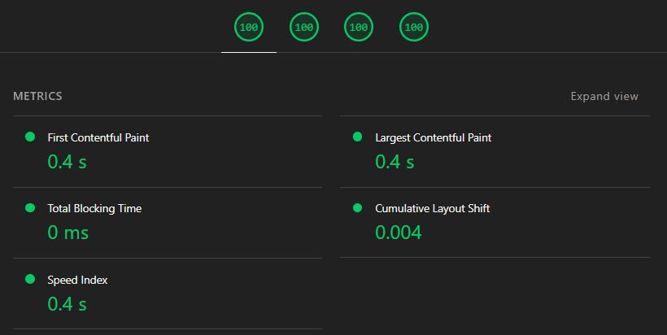

вопросы к дизайну:

1. Alt+Shift логотип, почему не текст?
2. в макетах желательно использовать размеры кратные 2 или 4, например отступ между иконкой и Alt+Shift 12.67, я беру 12
3. ошибка: кнопка Generate Now при загрузке меняет размер с 60 на 56
4. в кнопке с иконкой домика цвет иконки rgba(52, 64, 84, 1) в кнопке "copy to clipvoard" background: rgba(71, 84, 103, 1); уточнить не ошибка ли эта, потому что газом разницу почти не видно

пометки:

1. использую не все шрифты а только те которые нужны
2. оживил иконку загрузки на кнопке
3. сделал ещё и редактирование
4. прикрутил react compiler чтобы улучшить производительность
5. в проекте используется FSD (расписать очень подробно)
